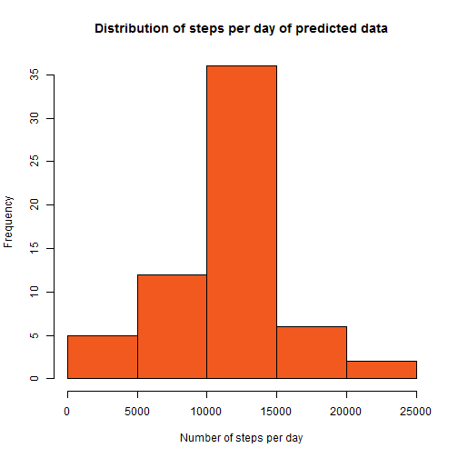

Analysis of step tracking data
==============================

Scope of this study
-------------------

With the advent of the quantified-self-movement, the analysis of activity-patterns gains a strong momentum. Creating transparency about routines and habits establishes a base for the optimisation of ones own fitness level.

To illustrate the procedure of analysing activity-data, we will perform a rudimentary analysis. 

The data
--------

We will analyse data about the number of steps a test person has made in a time-frame two month. The datafile consists the number of steps a person realised in time-intervals of 5 Minutes every day in the time-frame October-November 2012.

Processing the data
-------------------

The data needs no further processing. It is read in via the command:


```r
filename<-"activity.csv"
data<-read.csv(filename)
```


Aggregated properties 
---------------------

To gain insight into the amount of daily steps we calculate the total amount of steps taken each day. To grasp the dispersion of values we plot the data in a histogram.


```r
totalStepsPerDay<-aggregate(data[, 1], list(data[,2]), sum)
hist(totalStepsPerDay$x,xlab="Number of steps per day", main="Distribution of steps per day", col=rgb(red=152, green=228, blue=102,  names = NULL, maxColorValue = 255))
```

 

We see a bell-shaped-curve, with a skew towards the lower tail.

The mean and the median of daily-steps are as follows.


```r
mean(totalStepsPerDay$x,na.rm=TRUE)
```

```
## [1] 10766.19
```

```r
median(totalStepsPerDay$x,na.rm=TRUE)
```

```
## [1] 10765
```


Intra day activity patterns
---------------------------

To clarify the patterns of intra-day-activity-patterns we analyse the means of 5-minute timeframes across the recorded two month and plot it in a time series graph.


```r
meanStepsPerInterval<-tapply(data$steps,data$interval,mean,na.rm = TRUE)
meanStepsPerInterval<-data.frame("interval"=as.numeric(as.character(row.names(meanStepsPerInterval))),"mean"=meanStepsPerInterval[1:288])
meanStepsPerInterval$intervalPt<-strptime(formatC(meanStepsPerInterval$interval,width=4,format="d",flag="0"), "%H%M")

plot( meanStepsPerInterval$intervalPt,meanStepsPerInterval$mean, type="l", main="Mean of steps per Interval", ylab="mean of # of steps", xlab="time",lwd=2,col=rgb(red=152, green=228, blue=102,  names = NULL, maxColorValue = 255))
```

 

We can observe a clear peak in the morning. To be exact, the time-frame with the highest average step-amount is as follows.


```r
maxInterval<-meanStepsPerInterval[which.max(meanStepsPerInterval$mean),]
strftime(maxInterval$intervalPt, format="%H:%M")
```

```
## [1] "08:35"
```

Incorporating estimates for missing data
----------------------------------------

The data-set includes a great amount of missing data. Possible reasons are the absence of recorded steps, or technical difficulties in the recording process. The total amount of missing values is as follows.


```r
summaryData<-summary(data)
summaryData[7,1]
```

```
## [1] "NA's   :2304  "
```

This represents 13% of the cases.

In order to validate the results of the daily-activity-patterns we replace the missing values with specific estimates. Every missing value will be replaced with the distinctive 2-month average of the concering 5-minute time-interval. E.g., if we detect a missing Value in the time interval 00:00-00:05, we will replace the NA with the calculated average for this timeframe.


```r
data$stepsPredict<-data$steps
for(i in 1:nrow(data)) if(is.na(data[i,1])) data[i,4]<-meanStepsPerInterval[meanStepsPerInterval$interval==data[i,3],2]
newTotalStepsPerDay<-aggregate(data[, 4], list(data[,2]), sum)
```

Plotting the histogram for the newly created data we obtain the following graph.


```r
hist(newTotalStepsPerDay$x,xlab="Number of steps per day", main="Distribution of steps per day of predicted data", col=rgb(red=241, green=89, blue=31,  names = NULL, maxColorValue = 255))
```

 

Comparing the histograms we see no evidence for any significant changes in the activity distribution. The comparisons of the means and medians second this finding. 


```r
summaryData<-data.frame("raw data"=c(mean(totalStepsPerDay$x,na.rm=TRUE),median(totalStepsPerDay$x,na.rm=TRUE)),"predicted data"=c(mean(newTotalStepsPerDay$x,na.rm=TRUE),median(newTotalStepsPerDay$x,na.rm=TRUE)
))
row.names(summaryData)<-c("Mean","Median")

suppressWarnings(library(xtable))
print(xtable(summaryData),type="html",html.table.attributes=list("border='1' cellpadding='5' cellspacing='5'"))
```

<!-- html table generated in R 3.0.2 by xtable 1.7-4 package -->
<!-- Tue May 12 14:19:12 2015 -->
<table border='1' cellpadding='5' cellspacing='5'>
<tr> <th>  </th> <th> raw.data </th> <th> predicted.data </th>  </tr>
  <tr> <td align="right"> Mean </td> <td align="right"> 10766.19 </td> <td align="right"> 10766.19 </td> </tr>
  <tr> <td align="right"> Median </td> <td align="right"> 10765.00 </td> <td align="right"> 10766.19 </td> </tr>
   </table>

To illustrate further, we compare the time series graphs for the two data sets.


```r
newMeanStepsPerInterval<-tapply(data$stepsPredict,data$interval,mean,na.rm = FALSE)
newMeanStepsPerInterval<-data.frame("interval"=as.numeric(as.character(row.names(newMeanStepsPerInterval))),"mean"=newMeanStepsPerInterval[1:288])

plot( meanStepsPerInterval$intervalPt,meanStepsPerInterval$mean, type="l", main="Mean of steps per Interval", ylab="mean of # of steps", xlab="time",lwd=2,col=rgb(red=152, green=228, blue=102,  names = NULL, maxColorValue = 255))
lines(meanStepsPerInterval$intervalPt,newMeanStepsPerInterval$mean,col=rgb(red=241, green=89, blue=31,  names = NULL, maxColorValue = 255))
```

 

We can observe no real differences. A very small difference in the calculated medians is the only hint  for a difference in the data-sets.


Comparing weekday-weekend-activity-patterns
-------------------------------------------

As a final insight, we analyse differences in weekday and weekend activity-patterns. Therefore we compare the time series graphs for both daytypes.


```r
data$tdate<-strptime(paste(data$date,formatC(data$interval,width=4,format="d",flag="0"), sep=" "),"%Y-%m-%d %H%M")

data$weekend<-"weekday"
for(i in 1:nrow(data)) if(weekdays(data[i,5])=="Samstag" | weekdays(data[i,5])=="Sonntag") data[i,6]<-"weekend"
data$weekend<-as.factor(data$weekend)


meanStepsPerWeekday<-tapply(data[data$weekend=="weekday",4],data[data$weekend=="weekday",3],mean,na.rm = TRUE)
meanStepsPerWeekday<-data.frame("interval"=as.numeric(as.character(row.names(meanStepsPerWeekday))),"mean"=meanStepsPerWeekday[1:288],"daytype"="weekday")
meanStepsPerWeekend<-tapply(data[data$weekend=="weekend",4],data[data$weekend=="weekend",3],mean,na.rm = TRUE)
meanStepsPerWeekend<-data.frame("interval"=as.numeric(as.character(row.names(meanStepsPerWeekend))),"mean"=meanStepsPerWeekend[1:288],"daytype"="weekend")

meanStepsPerDaytype<-rbind(meanStepsPerWeekday,meanStepsPerWeekend)


library(lattice)
xyplot(mean ~ interval | daytype, data=meanStepsPerDaytype, type="b",layout=c(1,2))
```

 

We can observe an intra-week peak in the morning daytime, which could be related to commuting to work. Apart from this peak, there is little evidence for other distinctions. 
